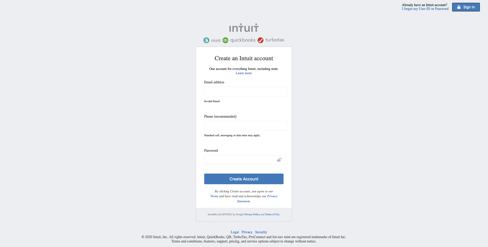

# intuit.com Sign Up Page

> intuit.com sign up page clone based on [Intuit Sign Up page](https://accounts.intuit.com/index.html)

This web page is developed by HTML5 and CSS only, without using any framework or library.

## Built With

- HTML5,
- CSS,
- Stylelint and stickler for linting purpose,
- html-validator-cli for validate HTML

## Live Demo

-  [Intuit Sign up page Clone Demo](https://rawcdn.githack.com/abredi/signup-page/dfe25cd4c36a884606aa89cd10545e7e465f007b/index.html)

## Getting Started

**Install on Your Own Machine.**
**You can skip the linter and HTML validetors setup if you don't want to validate the code**

Setup your machine setup

### Prerequisites

  > All the prerequisites are optional

- Git
- HTML validator
- CSS Linters

### Setup

- Follow the link below to install git.
  > [download git](https://git-scm.com/downloads)
- Follow the link below to setup HTML validator.
  > [Setup HTML validator](https://github.com/microverseinc/linters-config/tree/master/html_validator)
- Follow the link below to setup linter.
  > [Setup CSS Linter to check code errors](https://github.com/microverseinc/linters-config/tree/master/css#troubleshooting)
- Clone the repository
  > to clone the repository simply run the code below on your computer termial
  `git clone https://github.com/abredi/signup-page.git signup-page`

### Install

*Optional*
Go to the project directory on your terminal and run `npm install` to install the HTML validator and CSS linters

### Usage

Go to the project directory and run open the `index.html` file on your browser.

## Authors

👤 **Abdulaziz Ali**

- Github: [@abredi](https://github.com/abredi)
- Twitter: [@rediabdulaziz](https://twitter.com/rediabdulaziz)
- Linkedin: [linkedin](https://www.linkedin.com/in/abdulaziz-ali-98948011a)

👤 **Adesoji Adewumi**

- Github: [@AdesojiCodeMaster](https://github.com/AdesojiCodeMaster)
- Twitter: [@CodeMas22665735](https://twitter.com/CodeMas22665735)
- Linkedin: [linkedin](https://www.linkedin.com/in/adesoji-adewumi-7752aba5)

## 🤝 Contributing

Contributions, issues and feature requests are welcome!

Feel free to check the [issues page](issues/).

## Show your support

Give a ⭐️ if you like this project!

## Acknowledgments

- [Thanks for Microverse][https://github.com/microverseinc]

## 📝 License

This project is [MIT](LICENSE) licensed.
